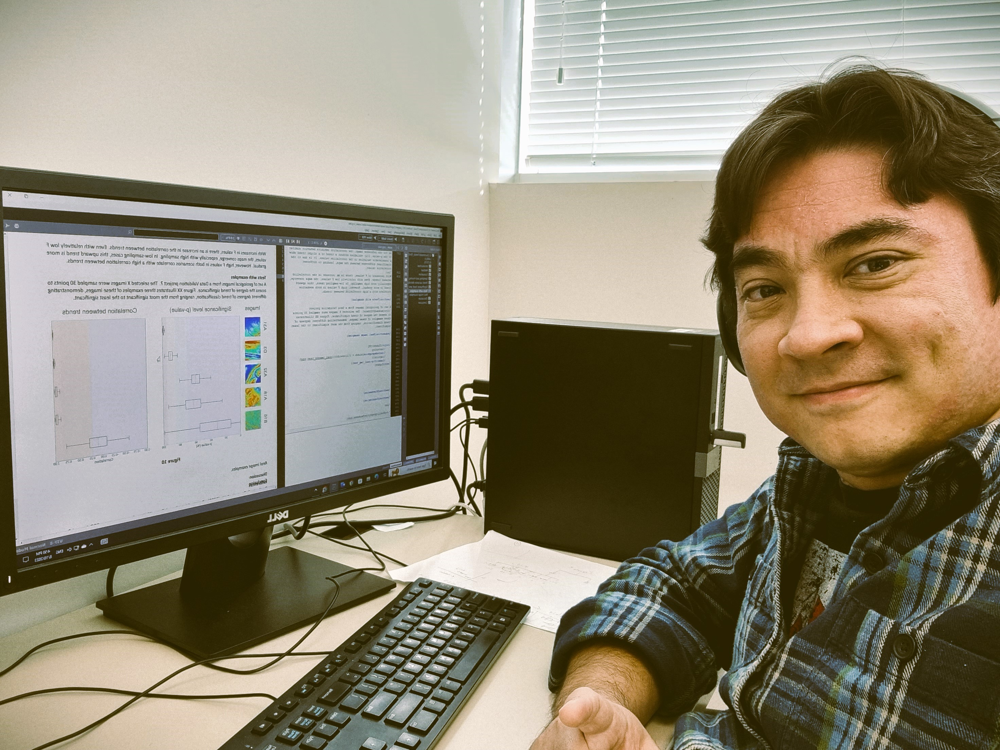

# Thiago Mizuno

  
  <h2>About Me</h2>
  

    I am Thiago Mizuno, a Geologist at Petrobras, specializing in reservoir modeling. I completed my B.Sc. in Geology at the State University of Campinas (UNICAMP) in 2009 and my M.Sc. in Geology at the Federal University of Rio Grande do Sul (UFRGS) in 2018. With over 13 years of experience in the oil industry, I have gained expertise in reservoir modeling, oil field development, forward stratigraphic modeling, and carbonate geology.
  

  

    My professional journey began in 2010 when I joined Schlumberger as a junior geologist at SIS. Later that same year, I transitioned to Petrobras, where I currently hold the position of Senior Geologist.
  

  

    In addition to my professional work, I am pursuing my Ph.D. at the University of Alberta under the guidance of Dr. Clayton Deutsch. My research focuses on reservoir modeling, incorporating trends and the use of secondary variables.
  

